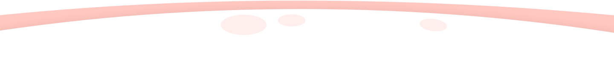

<!DOCTYPE html>
<html lang="zh-CN">
<head>
    <meta charset="UTF-8">
    <meta name="viewport" content="width=device-width, initial-scale=1.0">
    <meta http-equiv="X-UA-Compatible" content="ie=edge">
    <title>黑料网秘密入口_永久地址发布页_专属于宅男的秘密网址导航</title>
    <meta name="description" content="秘密网站入口是一款宅男宅女最喜爱的网站收录大全网站，本站旨在为您提供最新最全的黑料网秘密入口地址发布页，您可以发送任意邮件内容至黑料网秘密入口邮箱来自动回复最新地址！">
    <meta name="keywords" content="秘密网站,黑料网秘密入口,黑料网秘密入口加载,黑料网秘密入口发布页,黑料网秘密入口地址,黑料网秘密入口最新,黑料网秘密入口官网,最新地址,最新地址发布页,地址发布页,黑料网秘密入口导航">
    <link rel="shortcut icon" href="img/favicon.ico">
    <!-- 样式全部内联，移除外部style.css / star.css，使用可信任CDN的jQuery，星星效果用内联JS实现 -->
    
</head>
<body oncontextmenu="return false" onselectstart="return false" ondragstart="return false">
    

        

            

                
                <h2>专属于宅男的黑料秘密网址导航</h2>
                

                    <a class="btn pop android4" href="go/1.html" target="_blank">黑料地址一</a>
                    <a class="btn pop ios4" href="go/2.html" target="_blank">黑料地址二</a>
                    <a class="btn pop android3" href="go/3.html" target="_blank">黑料地址三</a>
                    <a class="btn pop ios3" href="go/4.html" target="_blank">黑料地址四</a>
                    <a class="btn pop android2" href="go/5.html" target="_blank">黑料地址五</a>
                    <a class="btn pop ios2" href="go/6.html" target="_blank">黑料地址六</a>
                

                
※黑料网秘密入口郑重承诺: 免费、无毒、绿色!

                

                    ※您还可以收藏永久发布地址：
                    <a href="#" style="color:#fff;text-decoration: underline;">https://veruye.com</a>
                

            

        

        <!-- 星空容器，用于动态绘制星星 -->
        

    

    
    

        

            <h2 class="main_title">
                常见问题
                黑料网秘密入口山寨版众多！很多无良小人直接镜像（或抄袭）本站，假“黑料网秘密入口”之名义骗取流量，大家务必仔细辨别（无良小人为了赚钱不惜放置钓鱼、诈欺广告）！
            </h2>
            

                

                    Q
                    
                        
如何更方便的访问“黑料网秘密入口”？

                        
1.使用“CTRL+D”将本页面添加至您的浏览器收藏夹内，方便下次访问

                        
2.请牢记发布页面地址

                    
                        

                            3.
                            <a style="color: #0000ff;" href="#" target="_blank">把黑料网秘密入口保存到本地</a>
                        

                        
5.把本站域名手写到您的记事本上

                    
                

            

            

            

                

                    Q
                    
                        
“黑料网秘密入口”是如何确保网站安全性的？

                        
1.本站所收录的全部网址均经过人工审核

                        
2.本站接受用户对违规站点的投诉，并及时下架违规站点

                    
                

            

                  

                

                

                    Q
                    
                      
                        
秘密基地入口专属宅基地在探索“黑料网秘密入口专属世界”的过程中，用户应增强安全意识，保护好自己的个人信息和财产安全

                    
                

            

            
        

    

    <footer>
        

        
黑料网秘密入口_永久地址发布页_专属于宅男的秘密网址导航.

            
Copyright © 2022-2025 All rights reserved.

        

    </footer>

    <!-- 使用可信任CDN的jQuery (替换原有/jquery.min.js) -->
    
    <!-- 移除email-decode.min.js 和 star.js，内置星空动画效果 -->
    
    <!-- 可添加简单 fallback，确保没有任何外部请求残留 -->
</body>
</html>
